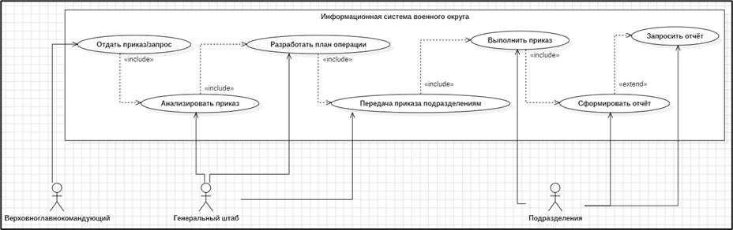
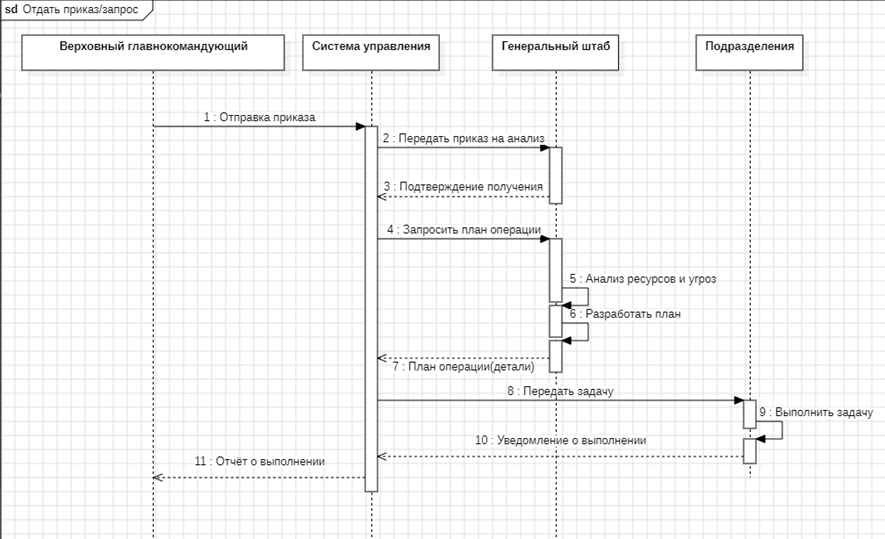
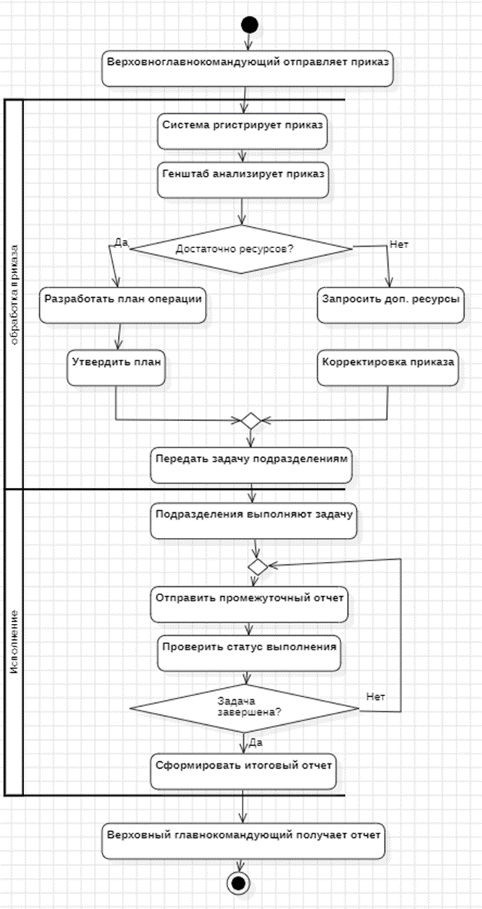
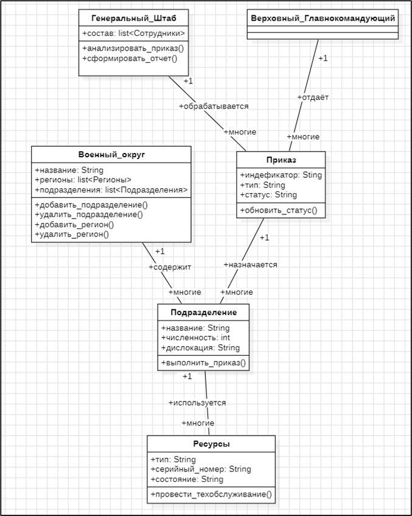
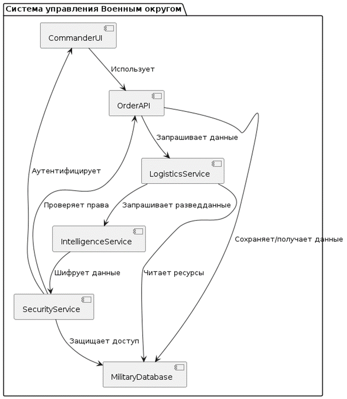
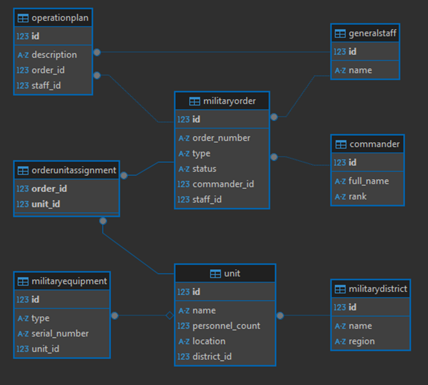

# 🎖️ Информационная система управления Военным округом

**Проект разработан в рамках курсовой работы по дисциплине "Проектирование информационных систем".**  
Система предназначена для автоматизации управления военными операциями, обработки приказов, контроля ресурсов и обеспечения безопасности данных в условиях реального времени.

---

## 📌 Основные особенности

- **Обработка приказов:** От формирования до исполнения, включая анализ ресурсов и планирование операций.
- **Управление подразделениями:** Учет дислокации, численности и технического оснащения войск.
- **Безопасность данных:** Шифрование каналов связи, ролевой доступ, резервное копирование.
- **Работа в экстремальных условиях:** Поддержка спутниковой связи и автономных полевых терминалов.
- **Масштабируемость:** Легкая интеграция новых подразделений и технологий (дроны, кибервойска).

---

## 🛠️ Технологии и инструменты

- **Моделирование:**  
  - `StarUML` — диаграммы UML (прецедентов, классов, последовательностей, размещения).  
  - `PlantUML` — генерация кода диаграмм.  

- **База данных:**  
  - `Microsoft SQL Server` — проектирование физической модели.  
  - `DBeaver` — администрирование и оптимизация запросов.  

- **Документирование:**  
  - `Markdown` — оформление документации.  

---

## 📂 Структура проекта

### 1. **Диаграммы UML**
#### Диаграмма прецедентов (Use Case)
  
*Взаимодействие Верховного главнокомандующего, Генштаба и подразделений.*

#### Диаграмма взаимодействия (Sequence)
  
*Логика обработки приказа: от отправки до исполнения.*

#### Диаграмма активностей (Activity)
  
*Поток выполнения операций: анализ ресурсов, разработка плана, исполнение.*

#### Диаграмма классов (Class)
  
*Структура данных: военные округа, подразделения, техника, приказы.*

#### Диаграмма компонентов (Component)
  
*Модули системы: интерфейс командующего, сервис логистики, безопасность.*

#### Диаграмма размещения (Deployment)
  
*Физическая архитектура: серверы, терминалы, спутниковые шлюзы.*

### 2. **Физическая модель БД**
- Таблицы: `MilitaryDistrict`, `Unit`, `MilitaryEquipment`, `MilitaryOrder`.  
- Связи: внешние ключи, индексы, ограничения целостности.  

---

### 3. **Модули системы**
- Интерфейс командующего (веб-приложение).  
- Сервис логистики (планирование ресурсов).  
- Модуль безопасности (аутентификация, шифрование).  

---

## 🚀 Примеры использования

- **Сценарий: Отправка приказа**  
  1. Верховный главнокомандующий формирует приказ через веб-интерфейс.  
  2. Система шифрует данные и передает их в Генштаб для анализа.  
  3. Генштаб разрабатывает план операции и распределяет задачи между подразделениями.  
  4. Подразделения подтверждают выполнение, данные синхронизируются с резервным сервером.  

---

## 📄 Лицензия

Проект распространяется под лицензией [MIT](LICENSE).  
